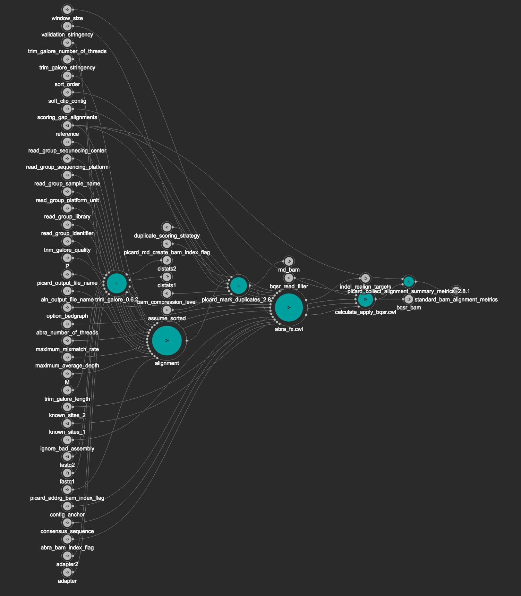

# Standard Bam Processing

This is the workflow used at MSK for producing standard bam files from the NY state-approved ACCESS assay. 

It is meant to be run on a single sample of paired read 1 and read 2 fastqs, from Illumina sequencing data, but may be generalizable to other sequencing platforms and sequencing panels as well.



