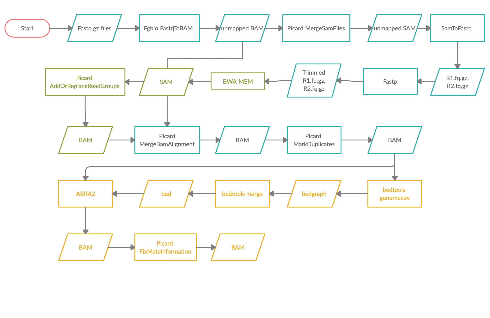

# Introduction

  

This is the workflow is written using Common Workflow Language \(CWL\) version 1.0 \([https://www.commonwl.org/v1.0/](https://www.commonwl.org/v1.0/)\) and is used at Memorial Sloan Kettering Cancer Center for producing standard bam files from the NY state-approved MSK-ACCESS assay.

It is meant to be run on a single sample paired-end FASTQ with unique molecular index\(UMI\), from Illumina sequencing data, but maybe generalizable to other sequencing platforms and sequencing panels as well, which produce paired-end data with UMIs.

For documentation visit: [https://msk-access.gitbook.io/uncollapsed-bam-generation/](https://msk-access.gitbook.io/uncollapsed-bam-generation/)

